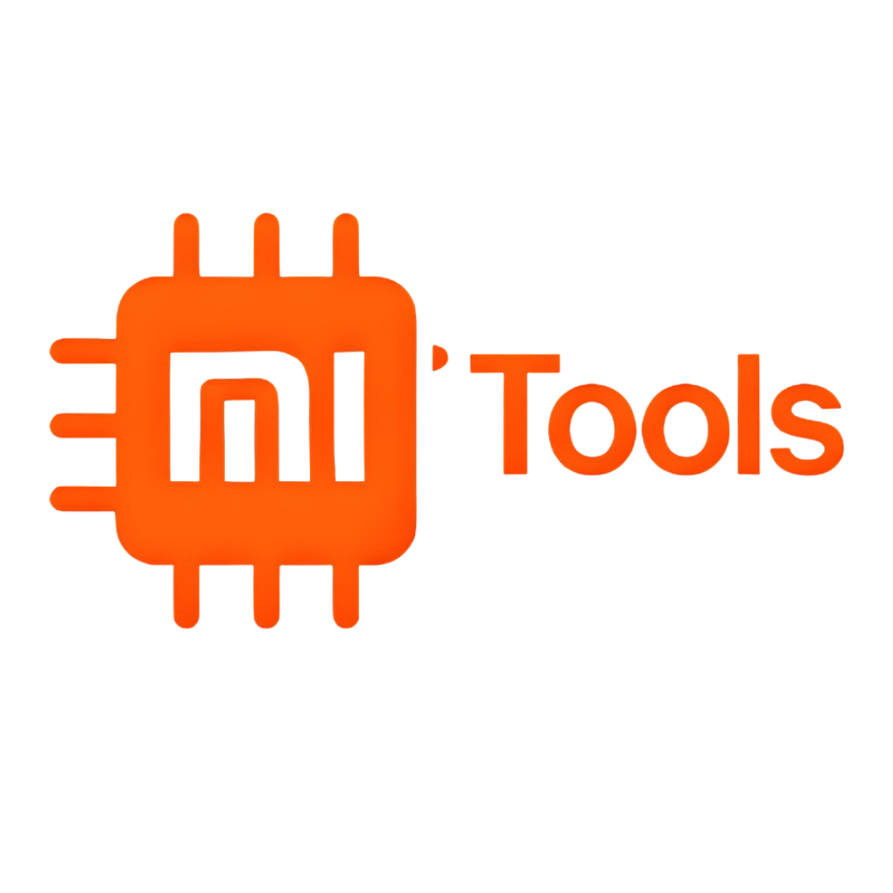
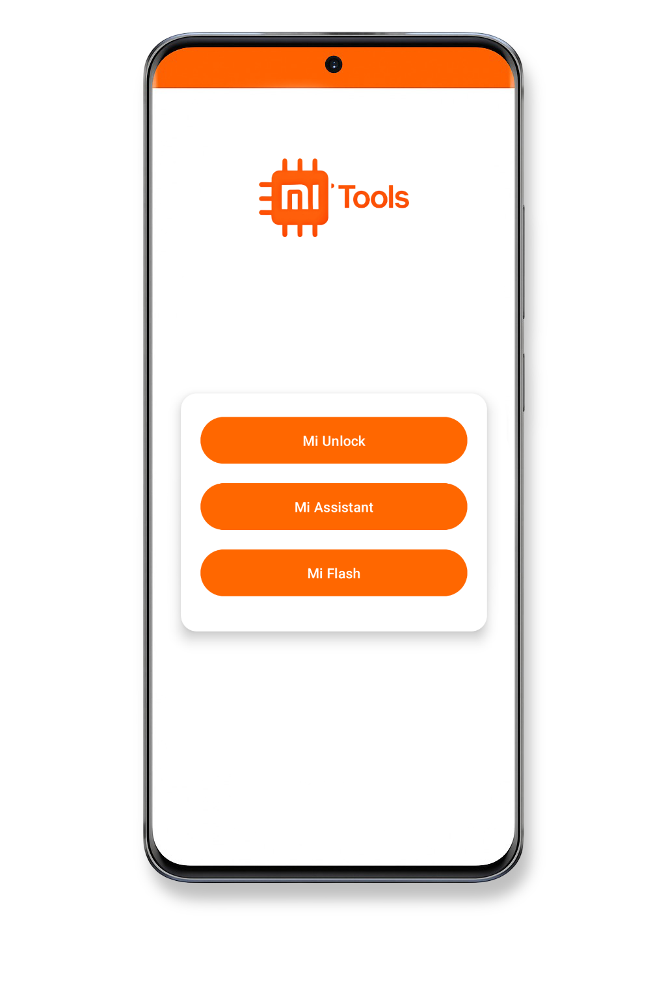

  

  

  <strong>In a world racing toward simplicity and speed, MiTools embodies a forward-looking vision to align tools with the demands of the era!</strong> 
  An application that transforms Xiaomi's official tools into a flexible mobile experience, replacing the need for a PC with the ability to use another phone!

---

  

---

  

---

  <strong>⚠️ Disclaimer ⚠️</strong> 
  MiTools is an unofficial app developed independently and is not affiliated with Xiaomi.

---

  <b><a href="LICENSE">Apache 2.0 License</a></b>

